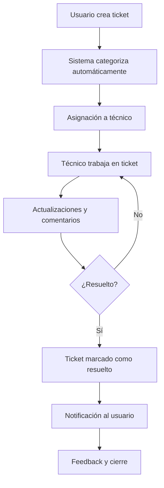

# 🔧 FixIT - Sistema de Gestión de Tickets de Soporte Técnico

[](https://dashboard.emprendetucarrera.com.co/)
[](https://nextjs.org/)
[](https://supabase.com/)
[](https://vercel.com/storage/blob)

## 📋 Descripción

**FixIT** es un sistema completo de gestión de tickets de soporte técnico diseñado para empresas que necesitan un control eficiente de solicitudes de soporte. El sistema permite a los usuarios crear, asignar, rastrear y resolver tickets de manera organizada y transparente.

## ✨ Características Principales

### 🎯 **Gestión de Usuarios**
- **Sistema de roles**: Usuario, Nivel 1, Nivel 2, Administrador
- **Registro y autenticación** segura
- **Gestión de perfiles** con información de contacto
- **Asignación automática** de tickets según roles

### 🎫 **Sistema de Tickets**
- **Creación de tickets** con categorización automática
- **Asignación inteligente** a técnicos especializados
- **Seguimiento de estado** en tiempo real
- **Historial completo** de actividades
- **Priorización** (Baja, Media, Alta, Crítica)

### 💬 **Comunicación**
- **Sistema de comentarios** integrado
- **Notificaciones por email** automáticas
- **Integración WhatsApp** para notificaciones
- **Seguimiento de cambios** con trazabilidad completa

### 📊 **Reportes y Analytics**
- **Dashboard administrativo** con métricas
- **Reportes de rendimiento** por técnico
- **Estadísticas de resolución** de tickets
- **Análisis de tiempos** de respuesta

### 🔄 **Sincronización**
- **Sistema de sincronización** en tiempo real
- **Backup automático** de datos
- **Recuperación de información** en caso de fallos

## 🛠️ Tecnologías Utilizadas

### **Frontend**
- **Next.js 14** - Framework React con App Router
- **TypeScript** - Tipado estático
- **Tailwind CSS** - Estilos y diseño responsivo
- **Radix UI** - Componentes accesibles

### **Backend**
- **Next.js API Routes** - API REST
- **Supabase** - Base de datos PostgreSQL
- **Vercel Blob** - Almacenamiento de archivos
- **Row Level Security (RLS)** - Seguridad de datos

### **Servicios Externos**
- **Google Gemini AI** - Categorización automática de tickets
- **Nodemailer** - Envío de emails
- **WhatsApp Business API** - Notificaciones
- **Hostinger SMTP** - Servidor de correo

### **Deployment**
- **Vercel** - Hosting y deployment automático
- **GitHub** - Control de versiones
- **pnpm** - Gestor de paquetes

## 🚀 Instalación y Configuración

### **Prerrequisitos**
- Node.js 18+ 
- pnpm
- Cuenta de Supabase
- Cuenta de Vercel

### **1. Clonar el repositorio**
```bash
git clone https://github.com/Rumlow05/v0-fixit10.git
cd v0-fixit10
```

### **2. Instalar dependencias**
```bash
pnpm install
```

### **3. Configurar variables de entorno**
Crear archivo `.env.local`:
```env
# Supabase
NEXT_PUBLIC_SUPABASE_URL=tu_supabase_url
NEXT_PUBLIC_SUPABASE_ANON_KEY=tu_supabase_anon_key

# Vercel Blob
BLOB_READ_WRITE_TOKEN=tu_vercel_blob_token

# Google Gemini AI
GOOGLE_GENAI_API_KEY=tu_gemini_api_key

# Email (Hostinger SMTP)
EMAIL_HOST=smtp.hostinger.com
EMAIL_PORT=587
EMAIL_USER=tu_email
EMAIL_PASS=tu_password

# WhatsApp
WHATSAPP_API_URL=tu_whatsapp_api_url
WHATSAPP_ACCESS_TOKEN=tu_whatsapp_token
```

### **4. Configurar base de datos**
Ejecutar scripts SQL en Supabase:
```bash
# Ejecutar en orden:
scripts/001_create_users_table.sql
scripts/002_create_tickets_table.sql
scripts/003_create_ticket_comments_table.sql
scripts/004_create_attachments_table.sql
supabase-create-activity-log.sql
```

### **5. Ejecutar en desarrollo**
```bash
pnpm dev
```

## 📁 Estructura del Proyecto

```
fixit10/
├── app/                    # Next.js App Router
│   ├── api/               # API Routes
│   │   ├── email/         # Servicios de email
│   │   ├── gemini/        # Integración AI
│   │   ├── tickets/       # CRUD tickets
│   │   ├── users/         # CRUD usuarios
│   │   └── whatsapp/      # Integración WhatsApp
│   ├── globals.css        # Estilos globales
│   ├── layout.tsx         # Layout principal
│   └── page.tsx           # Página principal
├── components/            # Componentes React
│   ├── ui/               # Componentes UI reutilizables
│   ├── Notification.tsx  # Sistema de notificaciones
│   └── AttachmentViewer.tsx # Visualizador de archivos
├── hooks/                # Custom hooks
├── lib/                  # Utilidades y configuración
│   └── supabase/         # Cliente Supabase
├── services/             # Servicios de negocio
│   ├── activityService.ts    # Gestión de actividades
│   ├── attachmentService.ts  # Gestión de archivos
│   ├── commentService.ts     # Gestión de comentarios
│   ├── emailService.tsx      # Servicio de email
│   ├── geminiService.ts      # Integración AI
│   ├── syncService.ts        # Sincronización
│   ├── ticketService.ts      # Gestión de tickets
│   ├── userService.ts        # Gestión de usuarios
│   └── whatsappService.ts    # Integración WhatsApp
├── scripts/              # Scripts SQL
├── utils/                # Utilidades
└── types.ts              # Definiciones TypeScript
```

## 🎮 Uso del Sistema

### **Para Usuarios**
1. **Crear ticket**: Describir el problema y seleccionar prioridad
2. **Seguimiento**: Ver el estado y comentarios del ticket
3. **Comunicación**: Agregar comentarios y recibir actualizaciones

### **Para Técnicos**
1. **Asignación**: Recibir tickets asignados automáticamente
2. **Resolución**: Trabajar en tickets y actualizar estado
3. **Comunicación**: Interactuar con usuarios y otros técnicos

### **Para Administradores**
1. **Gestión**: Crear y administrar usuarios
2. **Asignación**: Asignar tickets manualmente
3. **Reportes**: Generar reportes y estadísticas
4. **Configuración**: Gestionar configuraciones del sistema

## 🔐 Roles y Permisos

| Rol | Crear Tickets | Asignar | Resolver | Administrar | Reportes |
|-----|---------------|---------|----------|-------------|----------|
| **Usuario** | ✅ | ❌ | ❌ | ❌ | ❌ |
| **Nivel 1** | ✅ | ✅ | ✅ | ❌ | ❌ |
| **Nivel 2** | ✅ | ✅ | ✅ | ❌ | ❌ |
| **Administrador** | ✅ | ✅ | ✅ | ✅ | ✅ |

## 📱 Diseño Responsivo

- **Desktop**: Vista completa con sidebar y dashboard
- **Mobile**: Vista optimizada con navegación colapsible
- **Tablet**: Adaptación automática del layout

## 🔄 Flujo de Trabajo



## 🚀 Deployment

### **Vercel (Recomendado)**
1. Conectar repositorio a Vercel
2. Configurar variables de entorno
3. Deploy automático en cada push

### **URLs de Producción**
- **Aplicación**: https://dashboard.emprendetucarrera.com.co/
- **Admin Panel**: https://dashboard.emprendetucarrera.com.co/ (acceso admin)

## 🤝 Contribución

1. Fork el proyecto
2. Crear rama para feature (`git checkout -b feature/nueva-funcionalidad`)
3. Commit cambios (`git commit -m 'Agregar nueva funcionalidad'`)
4. Push a la rama (`git push origin feature/nueva-funcionalidad`)
5. Abrir Pull Request

## 📄 Licencia

Este proyecto está bajo la Licencia MIT. Ver `LICENSE` para más detalles.

## 📞 Soporte

Para soporte técnico o consultas:
- **Email**: soporte@emprendetucarrera.com.co
- **WhatsApp**: +57 300 123 4567
- **Issues**: [GitHub Issues](https://github.com/Rumlow05/v0-fixit10/issues)

## 🏆 Características Destacadas

- ⚡ **Rendimiento optimizado** con Next.js 14
- 🔒 **Seguridad robusta** con RLS de Supabase
- 📱 **Diseño responsivo** para todos los dispositivos
- 🤖 **IA integrada** para categorización automática
- 📧 **Notificaciones múltiples** (Email + WhatsApp)
- 🔄 **Sincronización en tiempo real**
- 📊 **Analytics y reportes** completos
- 🎨 **Interfaz moderna** y intuitiva

---

<div align="center">
  <strong>Desarrollado con ❤️ para optimizar el soporte técnico</strong>
</div>